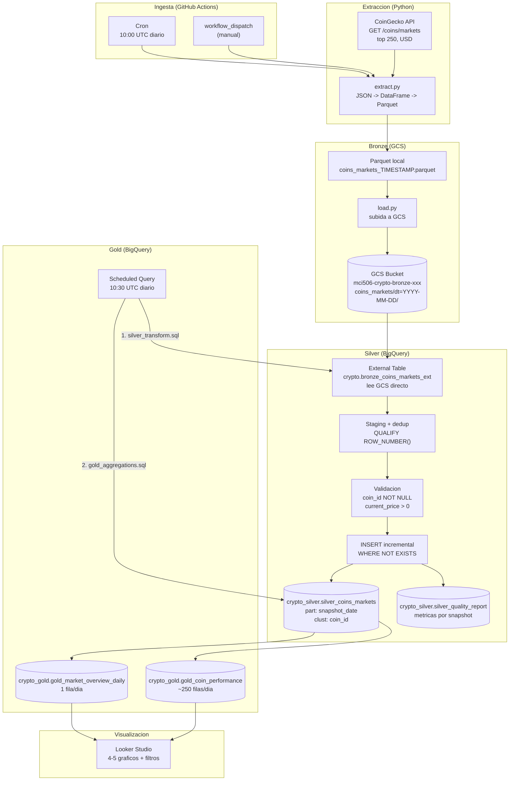

# ARCHITECTURE.md — Pipeline de Datos Cripto (CoinGecko)

Documento de arquitectura del pipeline medallion Bronze -> Silver -> Gold para
datos del mercado cripto. Este documento refleja y extiende el contrato de la
Parte 0 de `PROYECTO.md`.

---

## Diagrama de arquitectura

---

## Decisiones de diseno

### 1. Arquitectura medallion (Bronze -> Silver -> Gold)

- **Bronze** en Parquet sobre GCS: copia fiel del snapshot de la API, inmutable,
  particionada por fecha. Facilita reprocesamiento historico sin volver a pegarle
  a la API.
- **Silver** en BigQuery nativo: datos limpios, validados, tipados y deduplicados.
  Particionada por `snapshot_date` y clusterizada por `coin_id` para consultas
  eficientes por moneda y fecha.
- **Gold** en BigQuery: tablas de negocio materializadas con `CREATE OR REPLACE`,
  listas para consumir desde Looker Studio sin SQL complejo en el dashboard.

### 2. Parquet sobre GCS (no JSON, no CSV)

- Parquet preserva tipos nativos (int64, float64) -> el External Table de
  BigQuery hereda los tipos automaticamente, sin necesidad de casts en SQL.
- Compresion Snappy integrada: los ~250 registros diarios ocupan ~100-200 KB.
- Particionamiento Hive (`dt=YYYY-MM-DD/`) permite a BigQuery podar particiones
  al consultar por rango de fechas.

### 3. ELT en BigQuery (no ETL en Python)

- La transformacion ocurre dentro de BigQuery usando SQL nativo, sin mover datos
  a un entorno intermedio de procesamiento. Esto aprovecha la escalabilidad
  automatica de BigQuery y evita costos de compute externos.
- El unico proceso fuera de BigQuery es la extraccion desde la API (Python), que
  es liviano (~250 filas).

### 4. GitHub Actions como orquestador del extract

- Gratuito para repos publicos (2,000 min/mes en ubuntu-latest). Una ejecucion
  diaria de <1 minuto consume ~30 min/mes, muy por debajo del limite.
- `workflow_dispatch` permite re-ejecucion manual sin esperar al cron.
- Secrets nativos de GitHub (`GCP_SA_KEY`, `COINGECKO_API_KEY`, etc.) evitan
  exponer credenciales en el codigo.

### 5. BigQuery Scheduled Query para Silver->Gold

- Corre dentro de BigQuery sin infraestructura externa. Sin costo adicional
  (Scheduled Queries en si no tienen costo; solo el procesamiento de datos).
- Multi-statement: ejecuta `silver_transform.sql` y `gold_aggregations.sql` en
  una misma sesion, garantizando orden y atomicidad logica.
- Horario 10:30 UTC: 30 minutos despues del cron de GitHub Actions, margen
  suficiente para que el extract + load se complete.

### 6. Incremental con WHERE NOT EXISTS (no truncate + full reload)

- Silver usa `INSERT ... WHERE NOT EXISTS` sobre la clave de negocio
  `(coin_id, snapshot_date)`. Cada corrida solo inserta lo nuevo; re-correr
  no duplica ni pierde datos.
- Gold usa `CREATE OR REPLACE`: idempotente, siempre refleja el estado completo
  mas reciente de los datos en Silver.

### 7. Un solo bucket, una region

- Bucket GCS, datasets BigQuery y external table en `US` (o `us-central1`).
- Co-ubicacion elimina costos de egreso entre GCS y BigQuery para lecturas del
  external table.

---

## Costos estimados

### Google Cloud Storage (Bronze)

| Concepto | Estimacion |
|----------|------------|
| Volumen diario | ~200 KB (250 filas en Parquet comprimido) |
| Volumen mensual (30 dias) | ~6 MB |
| Volumen anual | ~73 MB |
| Costo almacenamiento (Standard, us-central1) | < $0.01/mes (primer GB gratuito en free tier) |
| Operaciones Clase A (upload, 1/dia) | ~30 ops/mes -> < $0.01 |

**Total GCS: practicamente $0** (dentro del free tier de GCP: 5 GB-mes gratis).

### BigQuery (Silver + Gold)

| Concepto | Estimacion |
|----------|------------|
| Silver: ~250 filas nuevas/dia, ~50 KB/dia | ~1.5 MB/mes almacenados |
| Gold overview: 1 fila/dia, negligible | ~30 filas/mes |
| Gold performance: ~250 filas/dia, ~30 KB/dia | ~1 MB/mes |
| Procesamiento diario (Silver incremental) | ~250 filas escaneadas (< 1 MB) |
| Procesamiento diario (Gold) | ~250 filas escaneadas + agregacion |
| Almacenamiento total | ~3 MB/mes, 10 GB gratis -> $0 |

**Total BigQuery: practicamente $0** (dentro del free tier: 10 GB almacenamiento,
1 TB consultas/mes gratis).

### GitHub Actions

| Concepto | Estimacion |
|----------|------------|
| Ejecuciones | 30/mes (cron diario) |
| Duracion por run | ~60 segundos |
| Minutos totales | ~30 min/mes |
| Limite gratuito (repos publicos) | 2,000 min/mes |

**Total GitHub Actions: $0.**

### CoinGecko API

- Plan Demo: gratuito, 30 calls/min, 10,000 calls/mes.
- Una call diaria = ~30 calls/mes. Muy por debajo del limite.

### Costo total estimado: **$0/mes** (todo dentro de free tiers).

---

## Escalabilidad

### Si el volumen de datos crece (ej. 1,000+ monedas, o ejecucion horaria)

- **Bronze:** GCS escala automaticamente. El particionamiento `dt=` evita
  escaneos completos del bucket. Si el bucket crece a GBs, se puede configurar
  lifecycle policies para mover datos viejos a Nearline/Archive.
- **Silver:** BigQuery escala a TBs sin cambios. Las particiones por
  `snapshot_date` y el clustering por `coin_id` mantienen queries eficientes.
  `WHERE NOT EXISTS` con anti-join sobre clave de negocio es eficiente incluso
  con millones de filas (BigQuery optimiza anti-joins sobre particiones).
- **Gold:** `CREATE OR REPLACE` escanea toda la tabla Silver. Si el volumen
  crece mucho, se puede limitar a la particion del dia (`WHERE snapshot_date = CURRENT_DATE()`).
- **GitHub Actions:** si la extraccion se vuelve mas pesada, se puede migrar a
  Cloud Run o Cloud Functions para mayor control de recursos.
- **Looker Studio:** extracto de datos automatico desde BigQuery. Si el volumen
  en Gold supera las capacidades de Looker Studio, se puede pre-agregar mas en Gold.

### Si se requiere near real-time

- Cambiar el cron de GitHub Actions a horario (ej. cada hora: `0 * * * *`).
- La Scheduled Query tambien a horario.
- Alternativa: migrar la ingesta a Cloud Functions + Pub/Sub con trigger HTTP
  desde Cloud Scheduler para menor latencia que GitHub Actions.

### Si se agregan mas fuentes de datos

- Nuevos scripts de extraccion en `scripts/` (ej. `extract_exchange.py`).
- Nuevas carpetas en el bucket Bronze (ej. `exchanges/`).
- Nuevos datasets en BigQuery con su propia logica Silver/Gold.
- La estructura modular lo soporta sin refactorizar lo existente.

---

## Seguridad

- **Service Account de GCP con minimo privilegio:**
  - `roles/storage.objectCreator` sobre el bucket Bronze (solo escritura).
  - BigQuery: permisos de lectura/escritura solo sobre los datasets `crypto`,
    `crypto_silver`, `crypto_gold`.
- **Secretos en GitHub Secrets** (nunca en el codigo): `GCP_SA_KEY`,
  `COINGECKO_API_KEY`, `GCS_BUCKET`, `GCP_PROJECT_ID`.
- **`.env.example` sin valores reales:** solo la estructura de variables.
- **Repo publico** con `main` protegida (requiere PR + 1 approval).

---

## Monitoreo

- **GitHub Actions:** historial de ejecuciones, logs por step, resumen en
  `$GITHUB_STEP_SUMMARY` (archivo + GCS URI). Notificacion por email nativa de
  GitHub en fallos de workflow (configurable en Settings -> Notifications).
- **BigQuery Scheduled Query:** historial en BigQuery Console con estado,
  duracion, errores.
- **Calidad de datos:** `crypto_silver.silver_quality_report` consultable
  directamente para detectar anomalias (ej. caida en `rows_loaded`, aumento de
  `null_price_count`).
