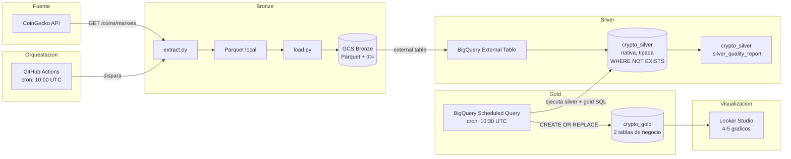

# MCI506 — Pipeline de Datos Cripto (CoinGecko)

Proyecto final de **Ingenieria de Datos (MCI506)** — Universidad Catolica Boliviana.

Pipeline **medallion Bronze -> Silver -> Gold** que extrae el mercado cripto (top 250 monedas,
fuente [CoinGecko](https://www.coingecko.com/)) y lo procesa de forma automatizada sobre
**GCS + BigQuery + GitHub Actions + Looker Studio**.

> El diseno completo, esquemas, nombres y reparto de tareas estan en **[`PROYECTO.md`](PROYECTO.md)**
> (contrato de implementacion del equipo).

---

## Diagrama del Pipeline



---

## Stack

| Capa | Herramienta |
|------|-------------|
| Extraccion | Python |
| Almacenamiento (Bronze) | Google Cloud Storage (Parquet) |
| Procesamiento (Silver/Gold) | BigQuery |
| Orquestacion del extract | GitHub Actions (cron) |
| Orquestacion Silver->Gold | BigQuery Scheduled Query |
| Visualizacion | Looker Studio |

---

## Estructura

```
Final-MCI-506/
├── scripts/
│   ├── extract.py        # Pull CoinGecko + Parquet local
│   ├── load.py           # Subida del Parquet a GCS (Bronze)
│   └── utils.py          # Config, logging, cliente GCS
├── sql/
│   ├── silver_transform.sql    # DDL + INSERT incremental
│   └── gold_aggregations.sql   # Tablas Gold de negocio
├── .github/workflows/
│   └── pipeline.yml      # Cron diario + workflow_dispatch
├── .env.example          # Variables de entorno (sin secretos)
├── README.md
├── ARCHITECTURE.md
├── PROYECTO.md
└── requirements.txt
```

---

## Las 7 preguntas del pipeline

### 1. QUE datos se mueven?

Snapshot diario del top 250 criptomonedas por capitalizacion de mercado desde
CoinGecko. Cada snapshot produce ~250 filas x 22 columnas con tipos nativos
(`int64`, `float64`, `string`). Dominio: cotizaciones de mercado cripto en USD.

Columnas incluidas: `coin_id`, `symbol`, `name`, `current_price`, `market_cap`,
`market_cap_rank`, `total_volume`, `high_24h`, `low_24h`, `price_change_pct_24h`,
`price_change_pct_7d`, `price_change_pct_30d`, `circulating_supply`,
`total_supply`, `max_supply`, `ath`, `ath_change_percentage`, `atl`,
`atl_change_percentage`, `last_updated`, `extracted_at`, `snapshot_date`.

### 2. DE DONDE vienen?

De la API publica de [CoinGecko](https://www.coingecko.com/):

```
GET https://api.coingecko.com/api/v3/coins/markets
  ?vs_currency=usd
  &order=market_cap_desc
  &per_page=250
  &page=1
  &price_change_percentage=24h,7d,30d
  &x_cg_demo_api_key=<API_KEY>
```

Como obtener la API key:
1. Registrarse en [coingecko.com](https://www.coingecko.com/)
2. Ir a **Developer Dashboard** y crear una API Key
3. El plan Demo (gratis) permite 30 calls/min y 10,000 calls/mes. Una call/dia esta muy por debajo del limite.

### 3. A DONDE van?

Los snapshots se almacenan en **Google Cloud Storage** en formato **Parquet**
con particionamiento Hive:

```
gs://mci506-crypto-bronze-<PROJECT_ID>/
└── coins_markets/
    └── dt=YYYY-MM-DD/
        └── coins_markets_YYYYMMDDTHHMMSSZ.parquet
```

Luego, un **BigQuery External Table** (`crypto.bronze_coins_markets_ext`) lee
directamente estos archivos Parquet, exponiendolos como tabla SQL sin mover los
datos. A partir de ahi, los datos se transforman en las capas Silver (`crypto_silver`)
y Gold (`crypto_gold`), todas en region `US`.

### 4. CUANDO corre?

| Evento | Horario | Gatillo |
|--------|---------|---------|
| Extraccion -> Bronze | **10:00 UTC** (06:00 Bolivia, UTC-4) | GitHub Actions cron |
| Silver -> Gold | **10:30 UTC** (06:30 Bolivia, UTC-4) | BigQuery Scheduled Query |

El pipeline tambien se puede disparar manualmente con `workflow_dispatch`
(Actions -> Crypto Pipeline -> Run workflow) desde la UI de GitHub.

### 5. COMO se procesan los datos?

Arquitectura **medallion (Bronze -> Silver -> Gold)**:

- **Bronze (GCS Parquet):** extract.py descarga de CoinGecko, enriquece con
  `extracted_at` y `snapshot_date`, castea tipos y escribe Parquet local.
  load.py sube el Parquet a GCS con la particion `dt=` en la ruta.

- **Silver (BigQuery nativa, tipada):** Un BigQuery External Table lee el
  bucket Bronze. Una Scheduled Query diaria ejecuta `silver_transform.sql` que:
  1. Deduplica intra-batch con `QUALIFY ROW_NUMBER() OVER (PARTITION BY coin_id, snapshot_date ...)`
  2. Valida (`coin_id IS NOT NULL AND current_price > 0`)
  3. Inserta incrementalmente con `WHERE NOT EXISTS` para no duplicar
  4. Genera `silver_quality_report` por snapshot

- **Gold (BigQuery, tablas de negocio):** La misma Scheduled Query ejecuta
  `gold_aggregations.sql` con `CREATE OR REPLACE`, generando:
  - `gold_market_overview_daily` (1 fila/dia con indicadores globales)
  - `gold_coin_performance` (~250 filas/dia con metricas por moneda)

### 6. Como se asegura la CALIDAD?

- **Validacion en Bronze:** `extract.py` verifica que la respuesta HTTP sea 200
  y que el DataFrame tenga las 22 columnas esperadas.
- **Validacion en Silver:** descarta filas con `coin_id` nulo y `current_price <= 0`.
- **Deduplicacion:** `QUALIFY ROW_NUMBER()` en Silver elimina duplicados dentro
  del batch; `WHERE NOT EXISTS` evita insertar snapshots ya existentes.
- **Reporte de calidad:** `silver_quality_report` cuenta por snapshot:
  `rows_loaded`, `null_price_count`, `duplicates_detected`, `min_price`, `max_price`.
- **Idempotencia:** nombres de archivo con timestamp (`coins_markets_YYYYMMDDTHHMMSSZ.parquet`)
  garantizan que re-ejecutar no sobrescribe ni duplica datos.

### 7. Y SI FALLA?

- **GitHub Actions:** los logs de cada ejecucion quedan disponibles en la
  pestana "Actions" del repo. Si un step falla, el pipeline escribe un
  resumen de fallo en `$GITHUB_STEP_SUMMARY` y marca el workflow como rojo.
- **BigQuery Scheduled Query:** el historial de ejecuciones se consulta en
  BigQuery -> Scheduled Queries, mostrando exito/fallo y duracion de cada run.
- **Re-ejecucion manual:** se puede disparar `workflow_dispatch` desde GitHub
  Actions en cualquier momento, sin esperar al cron.
- **Idempotencia total:** re-ejecutar no rompe ni duplica datos gracias al
  `WHERE NOT EXISTS` en Silver y los timestamps unicos en Bronze.
- **Contacto:** reportar fallos persistentes al equipo via GitHub Issues.

---

## Equipo

| Rol | Capa | Archivos |
|-----|------|----------|
| Persona 1 | Extraccion / Bronze | `scripts/extract.py`, `scripts/utils.py`, `requirements.txt` |
| Persona 2 | Transformacion (Silver/Gold) | `sql/silver_transform.sql`, `sql/gold_aggregations.sql` |
| Persona 3 | Orquestacion / Docs | `scripts/load.py`, `pipeline.yml`, `README.md`, `ARCHITECTURE.md`, `.env.example` |
